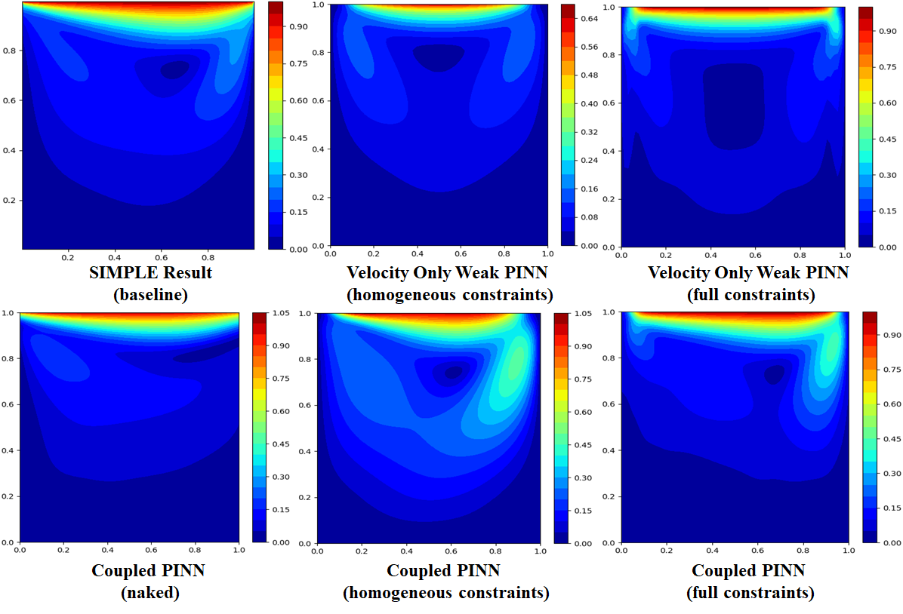
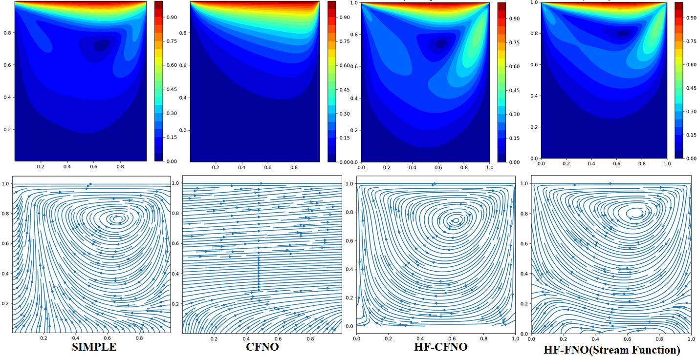

# High-Frequency band pass argumented Operator Learning 

In this filefolder, several experiments using various structures of PINN solving Lid-driven cavity flow problem at `Re=100` is conducted. From the final result it's obvious that applying hard constraints in the forward functions of PINN to encode boundary conditions as many as we can would appear to significantly improve the network performance especially in the cases without data supervision.

## Contents
- `PINN_Coupled_uvp.py`: PINN which takes `u,v,p` as output, trained by original Navier-Stokes equations;
- `PINN_VelocityOnly.py`: PINN which limits the output dimension with only `u, v`, with minimal energy functional training objective (weak solution), additionaly integrating the strong formation of vorticity, continuity, pressure Possion equations.
- `simple_traditional.py`: Very old-school SIMPLE algorithm, but a vectorized, paralleled one. Jacobian iteration is introduced to solve pressure modification equation instead of the conventional direct solution of a linear dynamic system which requires an $O(n^2)$ process to obtain the inversed, large-scaled matrix.
- `NeuroOperators.py`: Toolbox for operator learning methods `FNO,CNO,CFNO`. See [`../WhyWeakFNO`](../WhyWeakFNO) for more details. We also added 
- `CFNO_VelocityOnly.py`: the old version of CFNO.
- `CFNO_Coupled_uvp.py` : The opeator learning version of the related PINN programs, act as the main program of this filefolder.

## Update on Apr. 20th
- `simple_operator.py`: Uses the CFNO operator learning as the solver of pressure correlation equation to avoid complicated Krylov subspace based methods (BiCG, GMRES, etc.). Basic targets are generally satisfied. However, the issue of trivial solution has not been completely fixed yet.

## Update on May. 23th
- We fully upgraded the `NeuroOperators.py` and proposed 2 independent training strategies in the main program `CFNO_VelocityOnly.py`, assessed the influence of High frequency branches on the training performance.
- Added a comparison showing the importance of using hardconstraints, taking conventional PINNs as examples:



------
# Phased Conclusions
We found that explicitly incorporating high-frequency branches into neural operators is highly effective for representing nonlinear PDE solutions. In this study, we compared the original Fourier Neural Operator (FNO), a Chebyshev-Fourier Neural Operator (CFNO), in which each layer combines Fourier and Chebyshev spectral operators, and their high-frequency enhanced counterparts, denoted as HF-FNO and HF-CFNO.

## Notations

### Neural Operator Structure

Let $x \in \mathbb{R}^{B \times C_{\text{in}} \times H \times W}$ be the input field. The network first lifts it to a hidden feature field:

```math
v_0 = Q(x), \qquad v_0 \in \mathbb{R}^{B \times d \times H \times W}.
```

Here $Q$ is a pointwise linear lifting layer, and $d$ is the network width. The final projection is:

```math
\hat{u} = P(v_L).
```

Here $P$ is a pointwise MLP, and $L$ is the network depth.

For high-frequency models, Fourier coordinate features are first concatenated:

```math
x_\gamma = [x, \gamma(y,z)].
```

The Fourier feature embedding is:

```math
\gamma(y,z) =
\left[
    \sin(2\pi k y), \cos(2\pi k y),
    \sin(2\pi k z), \cos(2\pi k z)
\right]_{k \in \mathcal{B}},
\qquad \mathcal{B} = \{1,2,4,8\}.
```

### 1. FNO

The FNO layer uses a low-mode Fourier spectral operator plus a pointwise residual convolution:

```math
v_{\ell+1}
=
\mathcal{K}_F^{(m)}(v_\ell)
+
W_\ell v_\ell.
```

The low-mode Fourier spectral operator is:

```math
\mathcal{K}_F^{(m)}(v)
=
\mathcal{F}^{-1}
\left[
    \mathbf{1}_{|k|\le m}
    A_\ell(k)
    \mathcal{F}(v)(k)
\right].
```

Here $\mathcal{F}$ is the 2D FFT, $m$ is the retained Fourier mode number, $A_\ell(k)$ is a learnable complex-valued spectral weight, and $W_\ell$ is a $1\times1$ convolution.

The full FNO can be written as:

```math
\hat{u}_{\text{FNO}}
=
P \circ
\prod_{\ell=0}^{L-1}
\left(
    \mathcal{K}_F^{(m)} + W_\ell
\right)
\circ Q(x).
```

### 2. CFNO

CFNO replaces each pure Fourier spectral block with a mixed Fourier-Chebyshev block. The Chebyshev/DCT spectral operator is:

```math
\mathcal{K}_C^{(p,q)}(v)
=
\mathcal{C}^{-1}
\left[
    \mathbf{1}_{i \le p,\, j \le q}
    B_\ell(i,j)
    \mathcal{C}(v)(i,j)
\right].
```

Here $\mathcal{C}$ is the 2D DCT/Chebyshev transform, $(p,q)$ are the retained Chebyshev modes, and $B_\ell(i,j)$ is a learnable real-valued Chebyshev spectral weight.

The CFNO block is:

```math
\mathcal{K}_{CF}(v)
=
\alpha_\ell \mathcal{K}_F^{(m)}(v)
+
(1-\alpha_\ell)\mathcal{K}_C^{(p,q)}(v)
+
\mathcal{W}_{f,\ell}
\left[
    \mathcal{K}_F^{(m)}(v),
    \mathcal{K}_C^{(p,q)}(v)
\right],
```

where:

```math
\alpha_\ell = \sigma(a_\ell).
```

Here $\alpha_\ell$ is a learnable Fourier-Chebyshev mixing coefficient, and $\mathcal{W}_{f,\ell}$ is a $1\times1$ fusion convolution.

The layer update is:

```math
v_{\ell+1}
=
\mathcal{K}_{CF}(v_\ell)
+
W_\ell v_\ell.
```

The full CFNO is:

```math
\hat{u}_{\text{CFNO}}
=
P \circ
\prod_{\ell=0}^{L-1}
\left(
    \mathcal{K}_{CF} + W_\ell
\right)
\circ Q(x).
```

### 3. HF-FNO

HF-FNO keeps the FNO low-frequency backbone but adds an explicit high-frequency correction path. The high-frequency branch is composed of two parts:

```math
\mathcal{K}_{HF}(v)
=
\mathcal{K}_{MB}(v)
+
\mathcal{K}_{LH}(v).
```

The multi-band Fourier operator is:

```math
\mathcal{K}_{MB}(v)
=
\mathcal{F}^{-1}
\left[
    A_{\text{low}}(k)\mathcal{F}(v)(k),
    \quad k \in \Omega_{\text{low}}
\right]
+
\mathcal{F}^{-1}
\left[
    A_{\text{high}}(k)\mathcal{F}(v)(k),
    \quad k \in \Omega_{\text{high}}
\right].
```

The low-frequency region is:

```math
\Omega_{\text{low}}
=
\{
    |k_\theta| \le m,\,
    |k_z| \le m
\}.
```

Here $\Omega_{\text{high}}$ is the selected high- $z$ band.

The local high-pass operator is:

```math
\mathcal{K}_{LH}(v)
=
M_\ell
\sigma
\left(
    P_\ell
    \left[
        D_\ell
        \left(
            v - \mathcal{A}(v)
        \right)
    \right]
\right).
```

Here $\mathcal{A}$ is local average pooling, $v-\mathcal{A}(v)$ is the local high-pass residual, $D_\ell$ is a depthwise convolution, and $P_\ell$ and $M_\ell$ are pointwise $1\times1$ convolutions.

The HF-FNO block is:

```math
\mathcal{H}_F(v)
=
\mathcal{K}_F^{(m)}(v)
+
g_\ell
\left[
    \mathcal{K}_{MB}(v)
    +
    \mathcal{K}_{LH}(v)
\right]
+
\mathcal{W}_{h,\ell}
\left[
    \mathcal{K}_F^{(m)}(v),
    \mathcal{K}_{MB}(v),
    \mathcal{K}_{LH}(v)
\right],
```

where:

```math
g_\ell = \sigma(\eta_\ell).
```

Here $g_\ell$ is a learnable scalar high-frequency gate.

The layer update is:

```math
v_{\ell+1}
=
\mathrm{GELU}
\left(
    \mathcal{H}_F(v_\ell)
    +
    W_\ell v_\ell
\right).
```

The full HF-FNO is:

```math
\hat{u}_{\text{HF-FNO}}
=
P \circ
\prod_{\ell=0}^{L-1}
\mathrm{GELU}
\left(
    \mathcal{H}_F + W_\ell
\right)
\circ Q([x,\gamma]).
```

### 4. HF-CFNO

HF-CFNO uses the CFNO block as the low-frequency backbone and adds the same explicit high-frequency correction path.

The HF-CFNO block is:

```math
\mathcal{H}_{CF}(v)
=
\mathcal{K}_{CF}(v)
+
g_\ell
\left[
    \mathcal{K}_{MB}(v)
    +
    \mathcal{K}_{LH}(v)
\right]
+
\mathcal{W}_{h,\ell}
\left[
    \mathcal{K}_{CF}(v),
    \mathcal{K}_{MB}(v),
    \mathcal{K}_{LH}(v)
\right].
```

The layer update is:

```math
v_{\ell+1}
=
\mathrm{GELU}
\left(
    \mathcal{H}_{CF}(v_\ell)
    +
    W_\ell v_\ell
\right).
```

The full HF-CFNO is:

```math
\hat{u}_{\text{HF-CFNO}}
=
P \circ
\prod_{\ell=0}^{L-1}
\mathrm{GELU}
\left(
    \mathcal{H}_{CF} + W_\ell
\right)
\circ Q([x,\gamma]).
```

### Final Structure Comparison

| Network | Low-frequency backbone | Chebyshev branch | Multi-band high-frequency branch | Local high-pass branch | Fourier coordinate features |
| --- | --- | ---: | ---: | ---: | ---: |
| **FNO** | Fourier | No | No | No | No |
| **CFNO** | Fourier + Chebyshev | Yes | No | No | No |
| **HF-FNO** | Fourier | No | Yes | Yes | Yes |
| **HF-CFNO** | Fourier + Chebyshev | Yes | Yes | Yes | Yes |


## Numerical Results

### 1. Lid-Driven Cavity Flow Problem, Re=100
In this stage, all models were trained for 5000 epochs with the same hard constraints properly enforced. The results show that, regardless of the training formulation, including whether a stream-function representation is used, neural operators equipped with an explicit high-pass structure produce more physically reasonable solutions than their original counterparts. Typical results, as shown below:



Notably, HF-FNO already shows a substantial improvement over CFNO. This indicates that the main performance gain does not primarily come from the Fourier-Chebyshev mixing itself, but from the explicit high-frequency correction mechanism. The CFNO backbone further improves boundary and non-periodic-direction compatibility, while the high-frequency branch provides the dominant contribution to nonlinear small-scale representation.

### 2. Application in Nuclear Thermal Hydraulic Design

Moreover, we also assessed each model in a practical engineering perspective. FNO, CFNO, HF-FNO and HF-CFNO were applied to estimate the flow field in the impeller of a main coolant pump in a lead-cooled fast reactor (LFR) at a certain speed and flow rate, where the high-frequency branches were set to `high_modes = 16`th order, other low frequency parts were `modes=8`th. To be fair, an additional FNO test is conducted at `modes=16`. By controlling the `width` of each layer (`depth=6` in all cases), all models were evaluated at a parametric scale around **1.5M**, and ran for 500 iteration at the same random seed. The results also suggest it's effective for Neural Operators introducing a individual HF gate to enhance the ability of representing highly non-linear target functions. For more details, please see in [500Epochs](https://github.com/LokimuKH19/Pump_Blade_Optimization_PINN_Framework/upload).

## Possible Explanations
