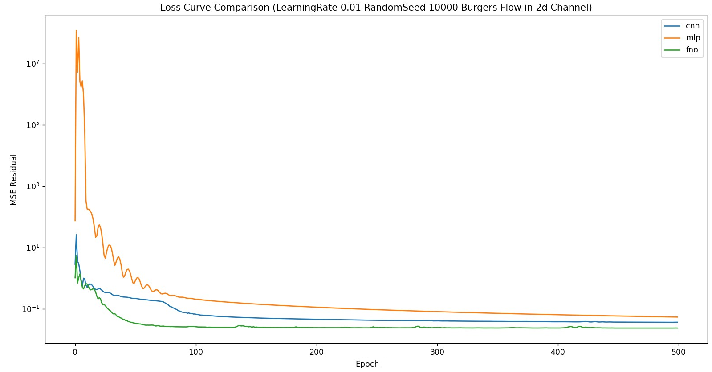

# ❓ Why SymPhONIC Chooses Weak-FNO as Its Solver

In SymPhONIC, our goal is to efficiently and accurately 3D fluid flow problems in an impeller with complex, parametric blade design, such as those found in an MCP in the Nuclear Reactor, while leveraging deep learning techniques. To determine the optimal neural solver, we conducted several comparative experiments using a steady-state 2D Burgers’ flow as a representative test case. Here, we summarize our findings.

---

## 1️⃣ Comparing FNO, CNN, and MLP (DNN)

**Experiment:**  
We implemented three models to learn the PDE solution from a small dataset (50 training samples, 64×64 grid):

- **FNO (Fourier Neural Operator)**
  - Uses spectral convolutions to operate directly in the frequency domain
  - Global representation of solution
  - 1024+ hidden channels in intermediate layers, width=32 for 2D layers

- **CNN**
  - Standard convolutional network with 3×3 kernels and 32–64 channels
  - Captures local patterns, requires deeper layers for global dependencies

- **MLP (Fully Connected DNN)**
  - Fully connected layers with 1024 neurons per layer
  - Flattened input/output, no spatial inductive bias

**Results:**  

| Model |  Residual MSE |
|-------|-----------------------------|
| FNO   | ~1e-8                        |
| CNN   | ~1e-5                         |
| MLP   | ~1e-4                         |

**Observation:**  
- **FNO outperforms CNN and MLP by several orders of magnitude**, even with limited data.  
- Reason: FNO captures global low-frequency modes efficiently, aligning naturally with PDE solutions.  
- CNN and MLP struggle to capture global patterns due to locality (CNN) or lack of spatial structure (MLP).  

**Conclusion:**  
> For smooth and regular flow fields, as in turbomachinery applications, FNO is the obvious choice.

---

## 2️⃣ Weak vs Strong Residual in PINN Framework

Next, we compared the effect of **weak-form residuals** vs **strong-form residuals** on training FNO:

- **Strong form:** Standard PDE residual computed at each grid point using finite differences.  
- **Weak form:** Residuals are integrated against random test functions (`phi_u`, `phi_v`), reducing sensitivity to local noise.  

We introduced **`num_elements`**, which controls the number of points in each batch where we additionally evaluate strong-form residuals to “anchor” the solution.  

**Findings:**

| `num_elements` | Residual MSE |
|----------------|--------------------|
| 0              | ~1e-5               |
| 1              | ~1e-8               |
| 50             | ~1e-8               |

**Interpretation:**

- Weak-form residuals capture the global structure of smooth solutions.  
- Adding **even a single strong-form point** drastically improves local accuracy, effectively “anchoring” the solution.  
- Increasing `num_elements` beyond 1 provides little additional benefit for smooth flows, making training more efficient.  

**Conclusion:**  
> For smooth, regular flow fields, a **Weak-FNO** approach—weak-form residuals combined with a few strong-form points—is sufficient for high-accuracy PDE learning.

---

## 3️⃣ Why SymPhONIC Uses Weak-FNO

Based on the experiments above:

1. **Global accuracy:** FNO captures the main solution modes efficiently.  
2. **Efficiency:** Weak-form residuals reduce sensitivity to grid resolution and high-order derivatives, avoiding excessive automatic differentiation overhead.  
3. **Minimal strong-point anchoring:** Only a few points are needed for local accuracy.  
4. **Robust to nonlinearity:** Even for nonlinear PDEs like Burgers’ equation, this combination maintains stability and precision.  

> Therefore, **Weak-FNO** is the natural choice as the solver in SymPhONIC for turbomachinery flows.

---

### 4️⃣ Mathematical Formulation (Steady-state 2D Burgers’ Flow)

The governing 2D Burgers’ equations:

```math
 u\frac{\partial u}{\partial x} + v\frac{\partial u}{\partial y} = \nu \left(\frac{\partial^2 u}{\partial x^2}+\frac{\partial^2 u}{\partial y^2}\right)
```
```math
u\frac{\partial v}{\partial x} + v\frac{\partial v}{\partial y} = \nu \left(\frac{\partial^2 v}{\partial x^2}+\frac{\partial^2 v}{\partial y^2}\right)
```

with viscosity `ν=0.01` and appropriate boundary conditions.  
Weak-form residuals are computed via integration against test functions `phi_u`, `phi_v`, while strong-form residuals are evaluated at selected points.
As for the boundary conditions, this filefolder's primary focus is on the **model's theoretical limit ability to converge to the steady-state solution**, rather than strictly enforcing physical boundary conditions. Therefore, we did not explicitly impose Dirichlet or Neumann boundary conditions. Trival solution (u=C1, v=C2) is acceptable for this ideal limit test.

- For smooth, low-frequency Burgers’ flows, the networks are still able to learn globally smooth solutions.  
- Not setting boundary conditions allows the model to explore trivial or globally minimal-residual solutions, which is sufficient for comparing the convergence performance of FNO, CNN, and MLP.  
- This setup simplifies the training process while demonstrating the **advantage of FNO in capturing global frequency modes**.  

> For future applications to real engineering flows or complex geometries, hard boundary constraints or physical boundary conditions can be introduced to improve the accuracy of the physical solution.


---

### 5️⃣ Summary

- **FNO > CNN > MLP** for smooth flow PDEs.  
- **Weak-form residual + 1 strong-point** achieves near-machine-precision accuracy.  
- SymPhONIC adopts **Weak-FNO** as the default solver for efficient, high-fidelity turbomachinery flow predictions.  

> In short: minimal strong-point anchoring + global spectral representation = high efficiency and accuracy.

### Performance Comparison on a non-trival case:
See the new experiment in `FNOvsCNNvsDNNwithBoundary`, 2d-steady state Burger's Flow in a channel. FNO still has obvious advantage during the first 500 epoch of training, showing a faster convergence speed.

