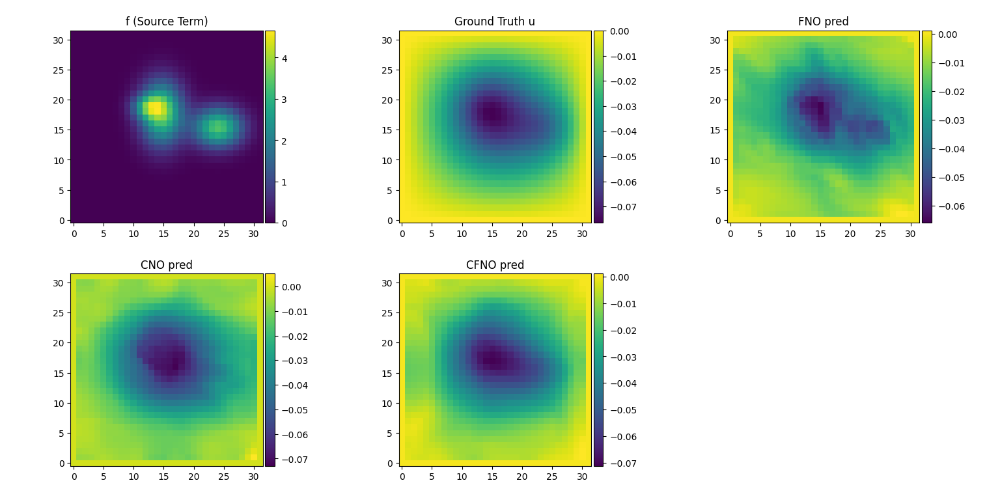

# ❓ Why SymPhONIC Chooses Weak-FNO as Its Solver

In SymPhONIC, our goal is to efficiently and accurately 3D fluid flow problems in an impeller with complex, parametric blade design, such as those found in an MCP in the Nuclear Reactor, while leveraging deep learning techniques. To determine the optimal neural solver, we conducted several comparative experiments using a steady-state 2D Burgers’ flow as a representative test case. Here, we summarize our findings.

---

## 1️⃣ Comparing FNO, CNN, and MLP (DNN)

**Experiment:**  
We implemented three models to learn the PDE solution from a small dataset (50 training samples, 64×64 grid):

- **FNO (Fourier Neural Operator)**
  - Uses spectral convolutions to operate directly in the frequency domain
  - Global representation of solution
  - 1024+ hidden channels in intermediate layers, width=32 for 2D layers

- **CNN**
  - Standard convolutional network with 3×3 kernels and 32–64 channels
  - Captures local patterns, requires deeper layers for global dependencies

- **MLP (Fully Connected DNN)**
  - Fully connected layers with 1024 neurons per layer
  - Flattened input/output, no spatial inductive bias

**Results:**  

| Model |  Residual MSE |
|-------|-----------------------------|
| FNO   | ~1e-8                        |
| CNN   | ~1e-5                         |
| MLP   | ~1e-4                         |

**Observation:**  
- **FNO outperforms CNN and MLP by several orders of magnitude**, even with limited data.  
- Reason: FNO captures global low-frequency modes efficiently, aligning naturally with PDE solutions.  
- CNN and MLP struggle to capture global patterns due to locality (CNN) or lack of spatial structure (MLP).  

**Conclusion:**  
> For smooth and regular flow fields, as in turbomachinery applications, FNO is the obvious choice.

---

## 2️⃣ Weak vs Strong Residual in PINN Framework

Next, we compared the effect of **weak-form residuals** vs **strong-form residuals** on training FNO:

- **Strong form:** Standard PDE residual computed at each grid point using finite differences.  
- **Weak form:** Residuals are integrated against random test functions (`phi_u`, `phi_v`), reducing sensitivity to local noise.  

We introduced **`num_elements`**, which controls the number of points in each batch where we additionally evaluate strong-form residuals to “anchor” the solution.  

**Findings:**

| `num_elements` | Residual MSE |
|----------------|--------------------|
| 0              | ~1e-5               |
| 1              | ~1e-8               |
| 50             | ~1e-8               |

**Interpretation:**

- Weak-form residuals capture the global structure of smooth solutions.  
- Adding **even a single strong-form point** drastically improves local accuracy, effectively “anchoring” the solution.  
- Increasing `num_elements` beyond 1 provides little additional benefit for smooth flows, making training more efficient.  

**Conclusion:**  
> For smooth, regular flow fields, a **Weak-FNO** approach—weak-form residuals combined with a few strong-form points—is sufficient for high-accuracy PDE learning.

---

## 3️⃣ Why SymPhONIC Uses Weak-FNO

Based on the experiments above:

1. **Global accuracy:** FNO captures the main solution modes efficiently.  
2. **Efficiency:** Weak-form residuals reduce sensitivity to grid resolution and high-order derivatives, avoiding excessive automatic differentiation overhead.  
3. **Minimal strong-point anchoring:** Only a few points are needed for local accuracy.  
4. **Robust to nonlinearity:** Even for nonlinear PDEs like Burgers’ equation, this combination maintains stability and precision.  

> Therefore, **Weak-FNO** is the natural choice as the solver in SymPhONIC for turbomachinery flows.

---

### 4️⃣ Mathematical Formulation

The governing equations (See in the `AnotherLinear Case` filefolder), a linear one. (could be modified into Burger's eq with little revisement):

```math
 \frac{\partial u}{\partial x} + \frac{\partial u}{\partial y} = \nu \left(\frac{\partial^2 u}{\partial x^2}+\frac{\partial^2 u}{\partial y^2}\right)
```
```math
\frac{\partial v}{\partial x} + \frac{\partial v}{\partial y} = \nu \left(\frac{\partial^2 v}{\partial x^2}+\frac{\partial^2 v}{\partial y^2}\right)
```

with `ν=0.01` and appropriate boundary conditions.  
Weak-form residuals are computed via integration against test functions `phi_u`, `phi_v`, while strong-form residuals are evaluated at selected points.
As for the boundary conditions, this filefolder's primary focus is on the **model's theoretical limit ability to converge to the steady-state solution**, rather than strictly enforcing physical boundary conditions. Therefore, we did not explicitly impose Dirichlet or Neumann boundary conditions. Trival solution (u=C1, v=C2) is acceptable for this ideal limit test.

- For smooth cases, the networks are still able to learn globally smooth solutions.  
- Not setting boundary conditions allows the model to explore trivial or globally minimal-residual solutions, which is sufficient for comparing the convergence performance of FNO, CNN, and MLP.  
- This setup simplifies the training process while demonstrating the **advantage of FNO in capturing global frequency modes**.  

> For future applications to real engineering flows or complex geometries, hard boundary constraints or physical boundary conditions can be introduced to improve the accuracy of the physical solution.


---

### 5️⃣ Summary

- **FNO > CNN > MLP** for smooth flow PDEs.  
- **Weak-form residual + 1 strong-point** achieves near-machine-precision accuracy.  
- SymPhONIC adopts **Weak-FNO** as the default solver for efficient, high-fidelity turbomachinery flow predictions.  

> In short: minimal strong-point anchoring + global spectral representation = high efficiency and accuracy.

### Performance Comparison on a non-trival case:
See the new experiment in `FNOvsCNNvsDNNwithBoundary`, added boundary condition into the equation. FNO still has obvious advantage during the first 500 epoch of training, showing a faster convergence speed.


> Still, maybe I'll consider corporate structures which can better reserve high frequency features with FNO together in the future.

## Wait... We might found a better approach...

`CFNOvsCNOvsFNO.py` & `CFNOvsCNOvsFNO_PINN.py`:

In this program the function is expanded through 1st Chebyshev Polinomials, defined in its triangle form:

```math
  T_k(x) = \rm{cos} \left(k \rm{arccos} x \right), x\in R, k\in Z_+
```

The expansion of the series could be simplified to DCT-II in discreted meaning, then accelerated by FFT.

Poission Results shows that combining Chebyshev polynomial and Fourier series as neural operator might cause some kind of improvements of the model's performance. However I don't think a linear example is persuasive for **no model does bad at these cases only if the code goes wrong**.

This example aims to illustrate the model's capability for solving a 2D-heat conduction problem with a source term f. And the function structure of the neural network is defined as `u=N(f)` (using the source term function itself as the input parameter) instead of `u=N(x,y)` in order to solve the problems with different source terms. Therefore, if the source term changes, you don't have to re-train the model again, which is time-consuming. Moreover, due to the problem is set up within a certain space, the numerical differentiation could be directly used for computing the physical loss regardless of the existence of the spatial coordinates in the network's input.




Someone informed me that the models are not compared in a fair way due to the structures are different, thus you can make FNO more complex in order to imporve its performance, e.g.:

```python
        "FNO": {"modes": 16, "width": 16, "depth": 6},
        "CNO": {"cheb_modes": (8, 8), "width": 16, "depth": 3},
        "CFNO": {"modes": 6, "cheb_modes": (8, 8), "width": 16, "depth": 3, "alpha_init": 0.5},
```

The accuracy comparison results are almost the same (CFNO>CNO>>FNO). Nothing changed.


## A wierd constant?

We recently discovered an interesting phenomenon while comparing PDE neural operators:
Whether using purely data-driven, hybrid PINN, or purely physical training methods, the Combined Fourier–Chebyshev Neural Operator (CFNO) significantly outperforms the traditional Fourier Neural Operator (FNO) without relying on CFD data. For example, the when the traininig points increased to 1024, and no data loss applied, the CFNO can capture the detailed tendency of the solution best:


FNO excels at capturing low-frequency trends in the solution, but often underfits high-frequency details. CFNO, on the other hand, combines Fourier (low-frequency) and Chebyshev (high-frequency) operators, with each layer having a learnable α to adaptively control the weighting of the two. Experiments show that, regardless of the problem definition, after training, the α per layer consistently converges to approximately 0.62, corresponding to a Fourier weight of sigmoid(0.62) ≈ 0.65 and a Chebyshev weight of ≈ 0.35.

This demonstrates that CFNO automatically learns to preserve the low-frequency smoothness in the PDE solution while also supplementing the necessary high-frequency details, enabling the network to capture both global trends and local features. In other words, CFNO's spectral mixing strategy not only improves prediction accuracy but also allows the network to find the optimal balance between low- and high-frequency features.

### Update 2025.09.05
- Applied a "Health Action" to the existing code. Added convenient hyperparameter settings and increased the results' readibility for future reproduction concerns. 

### Update 2025.10.06
- Added PINN mode into the `CFNOvsCNOvsFNO_PINN.py`, related to the result file `CFOresultPoisson_PINN`. 
- Added a 3D package `CFNO3D.py`, support for 3d CNO&CFNO solver.

### Update 2025.10.19
- Added the `input_features` and the `output_features` parameters into `CFNOvsCNOvsFNO_PINN.py` to make it a easy-to-use python module.

### Update 2025.10.20
- Computed 2D burgers flow test via the new program `CFNOvsCNOvsFNOvsDNNvsCNNwithBoundary.py`, result could be seen in the `./AnotherLinear Case` and `./Burgers` filefolders. I found that among the neural operators (CNO,FNO,CFNO) the CFNO has significant advantage in solving N-S equations especially with high Re (realized by adjusting the inlet flow velocity) by using the form $N(u_0, v_0)=(u,v)$ to make forward prediction. However, CNN also found to be better among all the models in some cases and has better capability to avoid oscillation.
- CNN's performance per parameter is very high in high-Re circumstances. My new plan is to Combine CNN with CFNO to achieve better convergence.
- Consider using the form $NeuralOprator(PINN(coords))=PredictedField$ to realize a global operator with the ability to predict on arbitray locations and with the PDE-solving advantages of the Neural Operators. So the `SuperNO.py` is added into this directory.
